# We Challenge You - Database APIs

[TOC]

## Schema

- This app uses the Node.js package sequelize as an ORM to manage our database schema and access layer. Several views are also used.
- The following is the current table/column depiction of the Challenge Board schema.

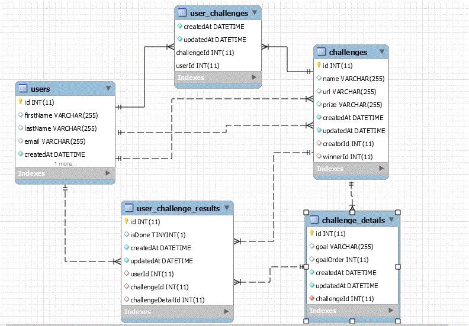

## Schema API Routes

- API routes for these tables pictured above are listed below.

## Users API Routes

- localhost:3000/api/users GET

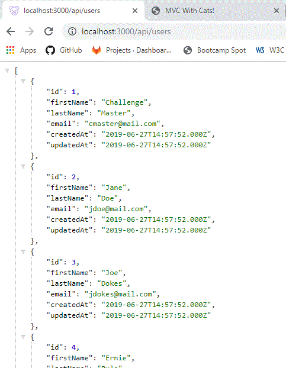

- localhost:3000/api/users/:id GET by id
- localhost:3000/api/users POST

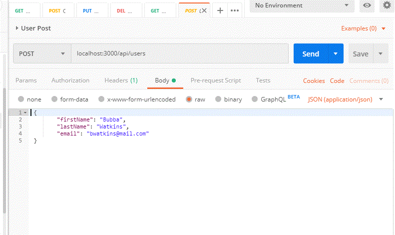

- localhost:3000/api/users PUT

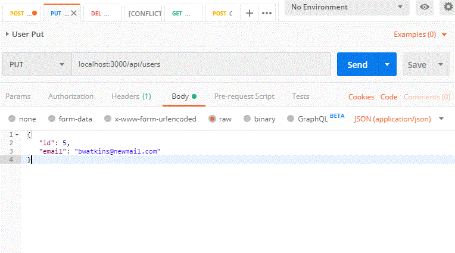

- localhost:3000/api/users/:id DELETE by id

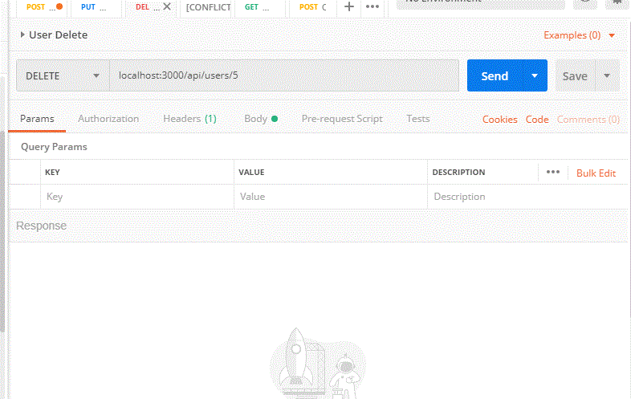

## Challenges API Routes

- localhost:3000/api/challenges GET

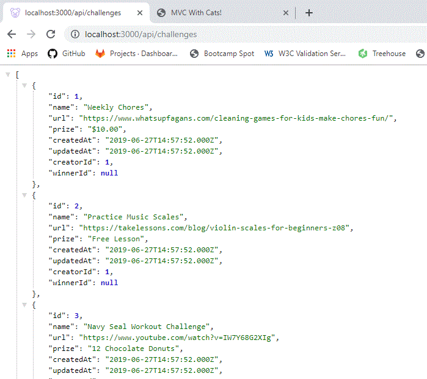

- localhost:3000/api/challenges/:id GET by id
- localhost:3000/api/challenges POST

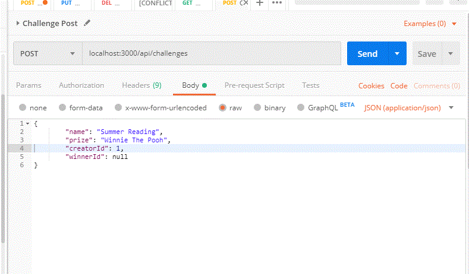

- localhost:3000/api/challenges PUT

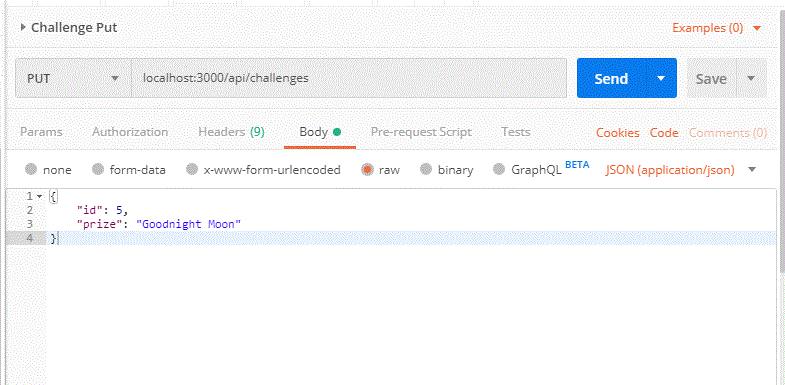

- localhost:3000/api/challenges/:id DELETE by id

## Challenge Details API Routes

- localhost:3000/api/challenge/details GET

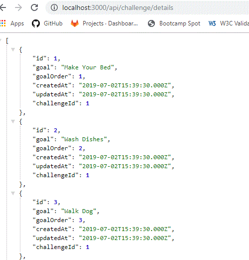

- localhost:3000/api/challenge/details/:cid GET details for a Challenge by challenge id

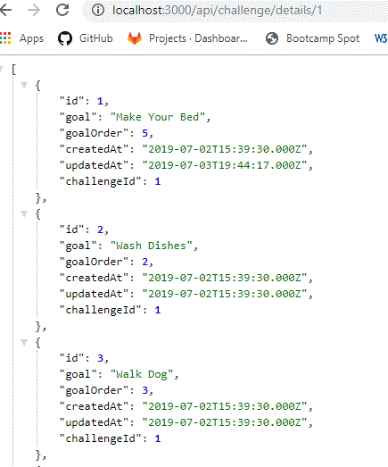

- localhost:3000/api/challenge/details POST

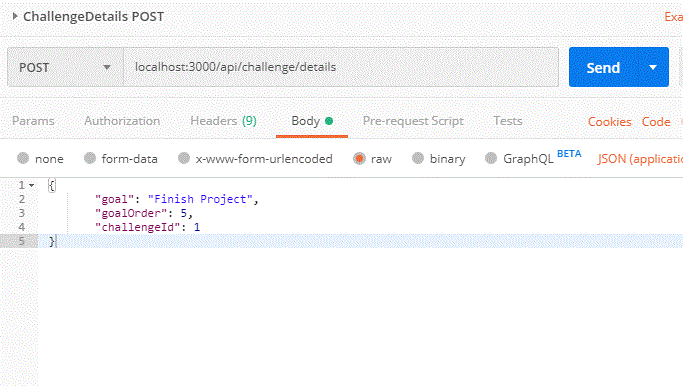

- localhost:3000/api/challenge/details PUT

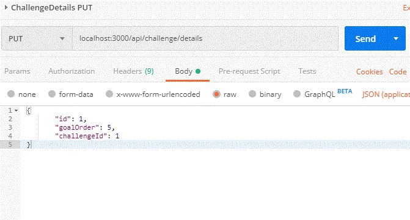

- localhost:3000/api/challenge/details/:id DELETE by Challenge Detail id

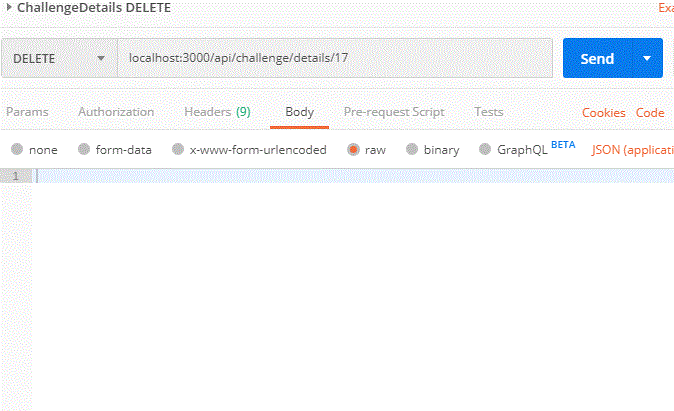

  